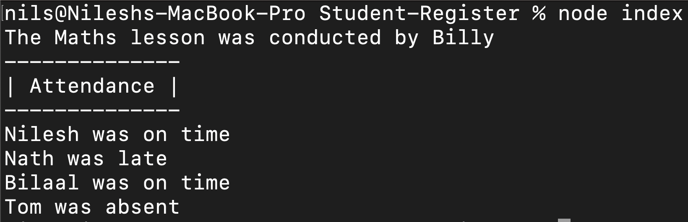

# Student-Register

## **This node application allows you to generate a lesson specifying the teacher and mark the attendance of the students.**

## **A student can be generated by passing their name into the Student class and can be stored as an array for the students attending that lesson.**

const Student = require('./student');

const student1 = new Student('Nilesh');

const student2 = new Student('Nath');

const student3 = new Student('Bilaal');

const student4 = new Student('Tom');

const studentsAttending = [student1, student2, student3, student4];

## **A teacher can be generated by passing in the teacher's name.**

const Teacher = require('./teacher');

const teacher = new Teacher('Maths', 'Billy');

## **A lesson can be generated by passing in the teacher and the subject taught.**

const mathsLesson = new Lesson(teacher, studentsAttending);

## **An error will be displayed if any of these parameters are not entered.**

## **Each student will be automatically be absent. You can then mark each student on time or late by the following methods.**

mathsLesson.markOnTime();

mathsLesson.markLate();

mathsLesson.outputSummary();

## **The application will display the lesson subject and teacher's name along with the attendance of the students. This can be call by running** __node__ __index.js__.

