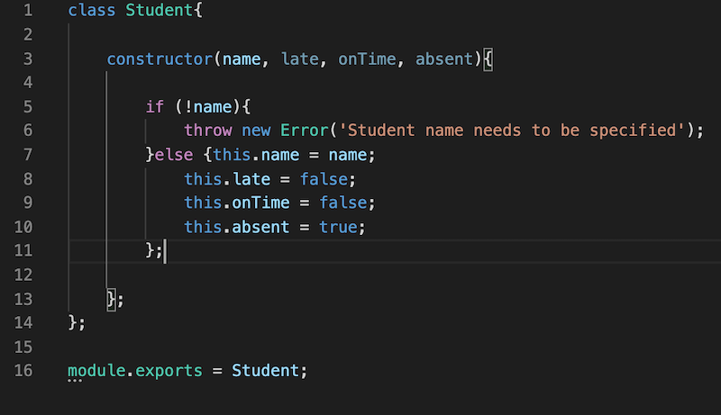

# Student-Register

This node application allows you to generate a lesson specifying the teacher and mark the attendance of the students.

A student can be generated by passing their name into the Student class and can be stored as an array for the students attending that lesson.

 

A teacher can be generated by passing in the teacher's name.
 

A lesson can be generated by passing in the teacher and the subject taught.

An error will be displayed if any of these parameters are not entered.

Each student will be automatically be absent. You can then mark each student on time or late by the following methods.

The application will display the lesson subject and teacher's name along with the attendance of the students. This can be call by running node index.js.

